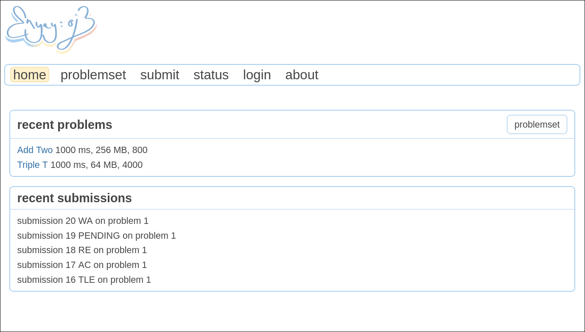
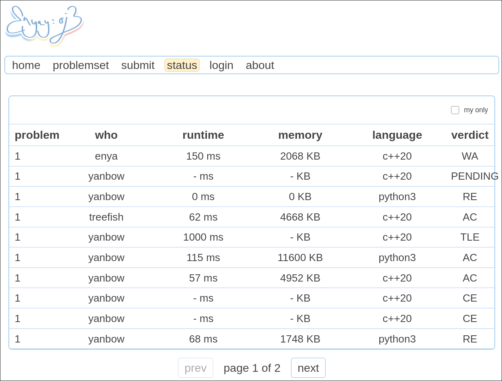

 
  
 <strong>
   ･ﾟ:*✧୨ online judge written in rust ୧.ೃ࿐
 </strong>
  
 ༶•┈┈୨♡୧┈┈•༶

 

enyay-oj is a online judge made entirely in Rust. 

the project is purely a personal project of [enya](https://github.com/3nya) and [yanbo](https://github.com/Yanboww) (enya-y)! But please feel free to contribute as well! 

We are still in our demo, and working on new features every day!

### Current Features
- Code submission in C++ and Python (returns verdict, runtime, memory usage)
- User login and submission tracking with Google Oauth

### Future Planned Features
- Polygon format support for uploading problems
- Migration to blob storage
- Deployment
